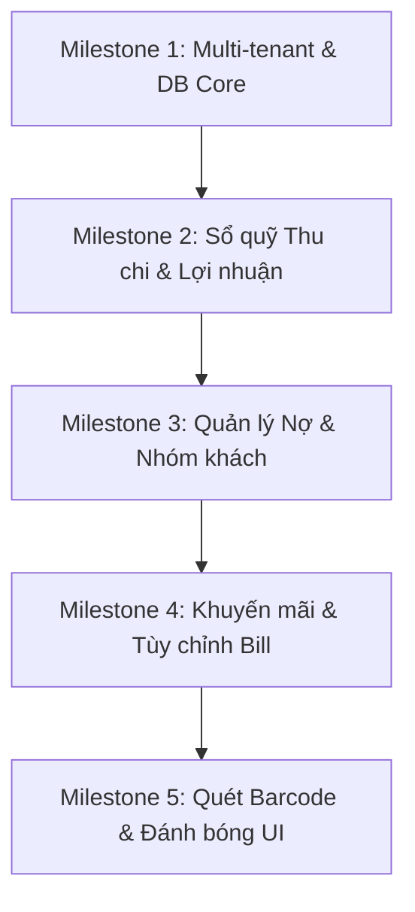

# Hướng đi phát triển (Roadmap) — mPOS Pro

Tài liệu này vạch ra lộ trình triển khai chi tiết các tính năng tối ưu hóa và bổ sung cho mPOS Pro nhằm tiệm cận năng lực của Sổ Bán Hàng và Pancake POS.

---

## 1. Lộ trình triển khai & Ước lượng nỗ lực

### Các cột mốc chính (Milestones)

| Cột mốc | Tính năng bao gồm | Nỗ lực ước tính | Độ phức tạp | Phụ thuộc |
|---|---|---|---|---|
| **M1: Multi-tenant & DB Refactoring** | - Thêm cột `store_id` vào toàn bộ 14 bảng dữ liệu. - Cập nhật `DatabaseHelper` (migration V10) và `DatabaseSeeder`. - Sửa toàn bộ lớp DAO để lọc theo `store_id` hoạt động. - Sửa `SessionManager` lưu `store_id` sau login. | 3 ngày | Cao | Không |
| **M2: Sổ quỹ & Lợi nhuận gộp** | - Tạo bảng `cashbook_transactions` quản lý Thu/Chi. - Thiết lập màn hình Thu chi (`IncomeExpenseActivity`). - Lưu `cost_price` lịch sử vào `order_items` khi bán hàng. - Cập nhật Báo cáo Lãi/Lỗ: `Doanh thu - Giá vốn + Thu nhập khác`. | 4 ngày | Trung bình | M1 |
| **M3: Công nợ & Nhóm khách hàng** | - Cập nhật bảng `orders` hỗ trợ thanh toán ghi nợ (`status = 'DEBT'`). - Tạo bảng `customer_debts` theo dõi dư nợ khách hàng. - Thiết lập màn hình ghi nợ, trả nợ tại quầy. - Hỗ trợ phân nhóm khách hàng (Nhóm VIP, Nhóm khách sỉ). | 3 ngày | Trung bình | M2 |
| **M4: Khuyến mãi & Tùy chỉnh Bill** | - Hỗ trợ giảm giá theo sản phẩm mua nhiều hoặc giảm giá đơn hàng. - Thêm màn hình thiết lập hóa đơn (ẩn/hiện logo, SĐT, địa chỉ, VietQR). - Dynamic generator hóa đơn in nhiệt theo kích thước giấy. | 3 ngày | Thấp | M2 |
| **M5: Quét Barcode thật & Đánh bóng UI** | - Tích hợp Google ML Kit Barcode và CameraX cho tính năng quét thật. - Thiết lập hệ thống widget giao diện dùng chung theo Design System. - Đồng bộ trải nghiệm visual, micro-interactions, responsive tablet. | 3 ngày | Trung bình | M1 |

---

## 2. Kế hoạch di chuyển dữ liệu (Migration Plan)

Khi nâng cấp DB lên phiên bản mới (`DATABASE_VERSION = 10`):
1. **Bảo toàn dữ liệu cũ**: Viết hàm `migrateV10(SQLiteDatabase db)` trong `DatabaseHelper.java`.
2. **Gán Tenant mặc định**: Thêm cột `store_id` với giá trị mặc định là `1` (Cửa hàng mặc định) cho toàn bộ các bản ghi hiện tại trong bảng `products`, `orders`, `customers`, `employees`, `users`, v.v.
3. **Thêm bảng mới**:
   - `CREATE TABLE IF NOT EXISTS cashbook_transactions (...)`
   - `CREATE TABLE IF NOT EXISTS customer_debts (...)`
4. **Cập nhật cấu trúc bảng phụ**:
   - Thêm cột `cost_price` vào bảng `order_items` để lưu lại giá vốn tại thời điểm bán hàng. Chạy truy vấn UPDATE gán giá vốn hiện tại từ bảng `products` sang cho các đơn hàng lịch sử.

---

## 3. Kế hoạch khôi phục (Rollback Plan)

Trong trường hợp phát sinh lỗi chí mạng (Crash vòng lặp hoặc hỏng cấu trúc SQLite) sau khi cập nhật:
1. **Sao lưu trước khi nâng cấp**: Hệ thống tự động kiểm tra sự tồn tại của file `mpos.db`. Nếu nâng cấp lỗi, người dùng có thể khôi phục bằng cách ghi đè file backup `mpos.db.bak` được tạo tự động trước khi chạy `onUpgrade`.
2. **Hạ cấp DB (Downgrade)**: 
   - Nếu phải hạ phiên bản ứng dụng, ghi đè hàm `onDowngrade` trong `DatabaseHelper` để xóa sạch các bảng mới thêm (`cashbook_transactions`, `customer_debts`) và khôi phục schema về phiên bản 9 nhằm tránh treo app.
3. **Lưu nhật ký lỗi ngầm**: Mọi lỗi xảy ra trong quá trình nâng cấp cơ sở dữ liệu sẽ được ghi nhận vào log file cục bộ để hỗ trợ chuẩn đoán từ xa.

---

## 4. Quản trị rủi ro (Risk Management)

| Rủi ro | Khả năng xảy ra | Tác động | Giải pháp phòng ngừa |
|---|---|---|---|
| **Lỗi khóa cơ sở dữ liệu (Database Locked)** | Trung bình | Cao | Sử dụng kết nối ghi đơn nhất (Single Write Connection) thông qua một thực thể `DatabaseHelper` dùng chung toàn ứng dụng. Chạy các tác vụ ghi nặng của Sổ quỹ trong background thread tuần tự. |
| **Ảnh hưởng hiệu năng do quét camera liên tục** | Thấp | Trung bình | Giới hạn tốc độ phân tích khung hình quét mã vạch (fps) bằng ML Kit xuống 5-10 khung hình/giây để tránh nóng máy và hao pin. |
| **Dữ liệu Tenant bị rò rỉ** | Thấp | Rất cao | Áp dụng cơ chế kiểm tra tính hợp lệ của `store_id` ở tầng DAO. Tất cả các phương thức truy vấn bắt buộc phải nhận tham số `store_id` từ Session đang hoạt động của người dùng hiện tại. |
